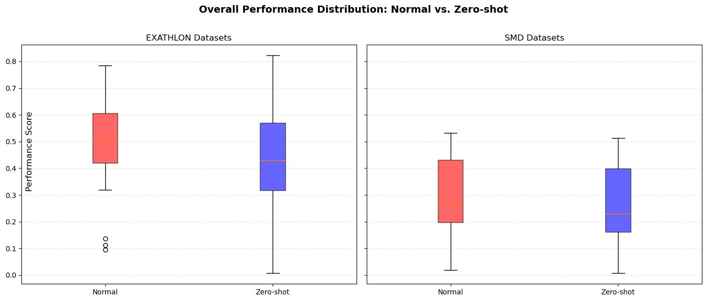
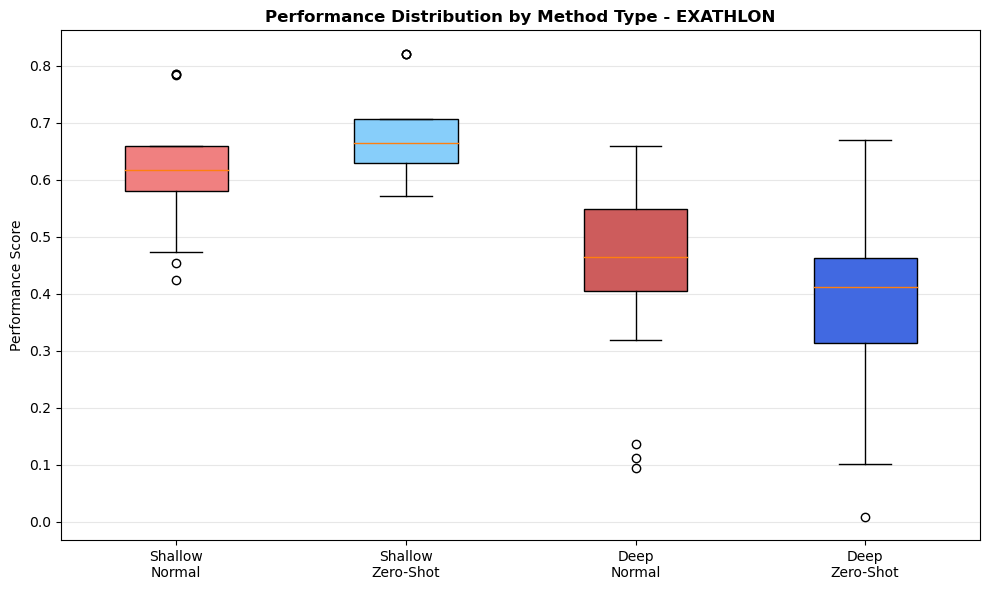
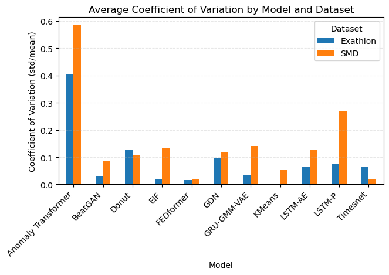

# Zero-shot Multivariate Time Series Anomaly Detection

Testing efficacy of anomaly detection models in a zero-shot multivariate time series setting.

## Findings

### 🎯 Key Finding: Zero-Shot Works!



*Zero-shot anomaly detection achieves performance statistically comparable to dataset-specific training (p ≥ 0.05)*

### 🔥 Surprise: Simple Beats Complex



*Shallow statistical methods (KMeans, EIF) often outperform sophisticated deep learning models in zero-shot scenarios*

### ⚖️ Model Stability Matters



*Anomaly Transformer shows extreme initialization sensitivity while KMeans/FEDFormer exhibit minimal variation*


## Setup

1. Checkout both the [TimeSeAD](https://github.com/wagner-d/TimeSeAD) benchmark and the [ZeroMTSAD](https://github.com/batman-nair/zeroMTSAD) repositories
```sh
git clone https://github.com/wagner-d/TimeSeAD
git clone https://github.com/batman-nair/zeroMTSAD
```
2. Create a new conda environment
```sh
conda create -n zero-mtsad
```
3. Install the TimeSeAD benchmark library
```sh
cd TimeSeAD/
conda env update --name zero-mtsad --file setup/conda_env_cuda117.yaml
conda activate zero-mtsad
pip install -e .[experiments]
cd ../
```
4. Install additional dependencies for the ZeroMTSAD experiments
```sh
cd zeroMTSAD/
conda env update --name zero-mtsad --file setup/environment.yml
```

## Running experiments

The experiment and dataset setup to run on is set by passing corresponding config files to the run script as
```sh
python run.py -c configs/smd/smd.yml configs/smd/lstm_ae.yml --seed 42
```

Changes to the parameters can be specified by adding overrides as another config file or passing them to the run itself.
```sh
python run.py -c configs/smd/smd.yml configs/smd/lstm_ae.yml --seed 42 --overrides "data_params.test_server_ids=[27]" "epochs=50"
```
OR
```sh
python run.py -c configs/smd/smd.yml configs/smd/lstm_ae.yml configs/smd/lstm_ae_tuned.yml --seed 42
```

The final test scores from the run will be dumped in a `results.json` file in the newly generated log folder.

## Hyperparameter tuning

The final parameters for the models are found using a hyperparameter optimization framework called [Optuna](https://optuna.org/).

To run the hyperparameter search, run the script with the experiment and dataset configs
```sh
python search.py -c configs/smd/smd_tuning.yml configs/smd/lstm_ae.yml
```

By default, search is done on the experiment's `tuning` module. To change search objective, specify the tuning module manually
```sh
python search.py -c configs/smd/smd_tuning.yml configs/smd/lstm_ae.yml -t schedulers
```

## Adding new models

The repository is setup for easy addition of new models from the TimeSeAD benchmark library.
All implemented models can be found in the `experiments` folder.

New models outside the TimeSeAD library can also be implemented as a Pytorch Lightning module following a similar structure to the `LitTimeSeADModel` class.


